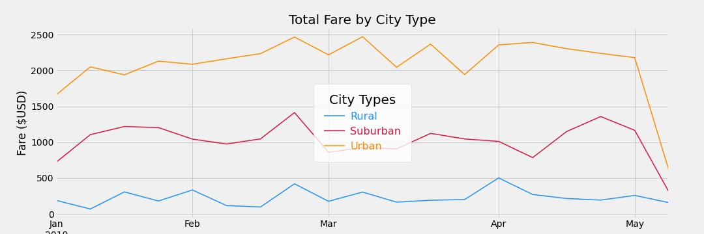

# PyBer Ride-Sharing Analysis

## Project Overview
We analyzed ride-sharing using two datasets using Pandas and Matplotlib in order to determine the rides, driver counts and fare for the different cities grouped by city type. 

### Main Goals of this Analysis:
    - create a comprehensive dataset by merging two source datasets
    - determine the number of rides and drivers as well as fares for each city type
    - create a table that summarizes results by city type
    - create line chart showing total fares 

## Resources
    - Dataset files: city_data.csv and ride_data.csv
    - Softwares/Tools: Anaconda Python 3.7.11, Jupyter Notebook, Terminal

## Results
### PyBer summary 
The table bellow summarizes the ride-sharing data by city type. Acocriding to this result the **Rural Cities** have the least numbe of rides and highes average fare per ride, while **Urban Cities** have the highest total number of rides and the lowest average fare per ride. This seams to suggest that there is an inverse relationship between fare and number of rides. Rural cities also have the lowest number of drivers. 
<table border="1" class="dataframe">
  <thead>
    <tr style="text-align: right;">
      <th></th>
      <th>Total Rides</th>
      <th>Total Drivers</th>
      <th>Total Fares</th>
      <th>Average Fare per Ride</th>
      <th>Average Fare per Driver</th>
    </tr>
  </thead>
  <tbody>
    <tr>
      <th>Rural</th>
      <td>125</td>
      <td>78</td>
      <td>$4,327.93</td>
      <td>$34.62</td>
      <td>$55.49</td>
    </tr>
    <tr>
      <th>Suburban</th>
      <td>625</td>
      <td>490</td>
      <td>$19,356.33</td>
      <td>$30.97</td>
      <td>$39.50</td>
    </tr>
    <tr>
      <th>Urban</th>
      <td>1,625</td>
      <td>2,405</td>
      <td>$39,854.38</td>
      <td>$24.53</td>
      <td>$16.57</td>
    </tr>
  </tbody>
</table>

## Project summary
 Based on the results of this analysis increasing the number of dirvers in rural cities could improve the number of rides and hence the revenue. 

